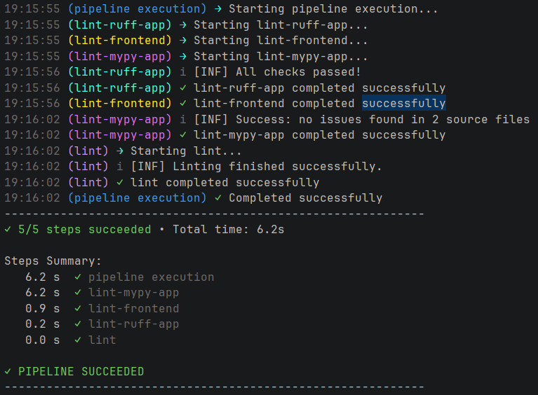

# Aspire Linting Support

When working in a polyglot multi-service application, having standard way to add and run mono repo actions is critical for developer onboarding, AI agent efficeincy and maintainability.

Using the aspire pipelines you can add custom commands to run on all supported services of your application.

In this example repo, I am adding linting support, but this could easily be used for testing, dependency scans & audit, and more.


# Usage
## Entire Stack
```bash
aspire do lint
```



## Only frontend:
```bash
aspire do lint-frontend
```


## Only backend:
```bash
aspire do lint-app
```


